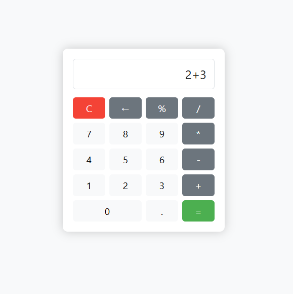

# 🔢 Simple Calculator App

A simple, responsive calculator built using **HTML**, **Bootstrap 5**, and **Vanilla JavaScript**. It supports basic arithmetic operations and is styled using Bootstrap's utility classes.

---

## 🚀 Features

- ✅ Responsive design using Bootstrap grid system  
- ✅ Basic operations: `+`, `-`, `*`, `/`, `%`  
- ✅ Clear (`C`) and backspace (`←`) buttons  
- ✅ Evaluation using `=`  
- ✅ Styled with Bootstrap 5  
- ✅ Works on mobile and desktop browsers  

---

## 📸 Preview

<!-- You can include a screenshot by placing an image named 'screenshot.png' in your project folder -->


---

## 🛠️ Technologies Used

- HTML5  
- CSS3  
- [Bootstrap 5](https://getbootstrap.com/)  
- JavaScript (Vanilla, DOM manipulation)  

---

## 📂 How to Use

1. **Clone the repository** or download the HTML file.

```bash
git clone https://github.com/yourusername/bootstrap-calculator.git
